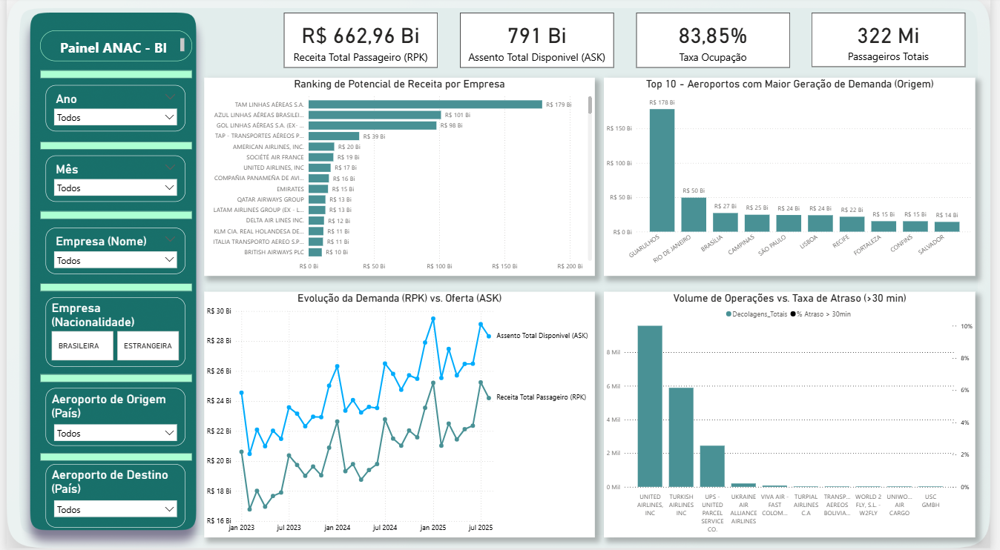

# 📊 Análise de Dados da ANAC

Este projeto apresenta uma análise de dados do setor aéreo brasileiro utilizando bases públicas da ANAC, com foco em demanda, oferta, receita, ocupação e desempenho operacional das companhias aéreas.

O trabalho envolve tratamento e modelagem dos dados, criação de métricas em DAX e desenvolvimento de um dashboard interativo no Power BI.

---

## 🎯 Objetivo da Análise

- Transformar dados brutos do setor aéreo em informações estratégicas, permitindo:
- Avaliar o desempenho das companhias aéreas
- Comparar demanda versus oferta ao longo do tempo
- Identificar aeroportos e empresas com maior potencial de receita
- Analisar impactos operacionais, como atrasos nos voos

---

## ❓ Perguntas de Negócio Respondidas

- Como a demanda (RPK) evolui em relação à oferta (ASK)?
- Quais companhias apresentam maior potencial de receita?
- Quais aeroportos concentram maior geração de demanda?
- Existe relação entre volume de operações e atrasos superiores a 30 minutos?
- Como esses indicadores variam por período e empresa?

---

## 🔍 Principais Insights

- A taxa média de ocupação de 83,85% indica bom aproveitamento da capacidade ofertada, com variações ao longo do tempo conforme o equilíbrio entre demanda (RPK) e oferta (ASK).

- O crescimento da demanda nem sempre acompanha a expansão da oferta, o que pode pressionar a taxa de ocupação em determinados períodos.

- O ranking de potencial de receita revela alta concentração em poucas companhias aéreas, indicando dependência do mercado em um grupo restrito de empresas.

- Os aeroportos de Guarulhos, Rio de Janeiro e Brasília concentram os maiores volumes de demanda, reforçando sua importância estratégica.

- Companhias com maior volume de operações tendem a apresentar maior incidência de atrasos superiores a 30 minutos, sugerindo desafios operacionais.

- A análise temporal evidencia sazonalidade, com períodos de pico que impactam demanda, oferta e desempenho operacional.

---

## 🛠️ Ferramentas Utilizadas

- Power BI
- DAX (Data Analysis Expressions)
- Excel

---

## 📈 Principais Indicadores (KPIs)

O dashboard apresenta os seguintes indicadores:

- 💰 Receita Total Passageiro (RPK)
- 💺 Assentos Totais Disponíveis (ASK)
- 📊 Taxa de Ocupação
- 👥 Total de Passageiros Transportados
- ⏱ Percentual de Atrasos acima de 30 minutos

---

## 📊 Análises Desenvolvidas

- Ranking de empresas por potencial de receita
- Top 10 aeroportos com maior geração de demanda
- Evolução temporal da demanda (RPK) vs oferta (ASK)
- Relação entre volume de operações e atrasos
- Análises dinâmicas com filtros por:
  - Ano
  - Mês
  - Companhia aérea
  - Nacionalidade da empresa
  - Aeroporto de origem e destino

---

## 🧮 Métricas Criadas em DAX

Foram desenvolvidas medidas em DAX para cálculo dos principais indicadores, incluindo:

- Receita Total Passageiro (RPK)
- Assentos Totais Disponíveis (ASK)
- Taxa de Ocupação
- Total de Passageiros
- Percentual de atrasos acima de 30 minutos

---

## 📁 Estrutura do Projeto

- data/ → Bases de dados em Excel
- powerbi/ → Arquivo do dashboard em Power BI (.pbix)
- docs/ → Documentação e imagens do projeto

---

## 📌 Contexto

Projeto desenvolvido no contexto acadêmico, com foco na aplicação prática de conceitos de Análise de Dados, modelagem, DAX e visualização, simulando um cenário real de análise gerencial no setor aéreo.

---

## 🖼️ Preview do Dashboard

